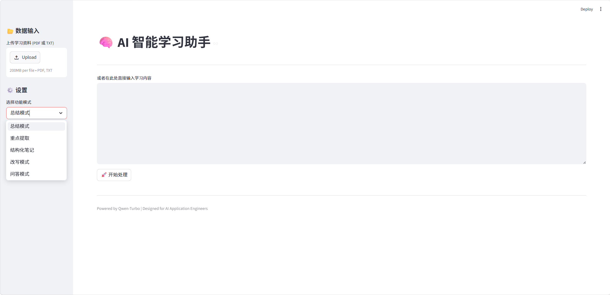
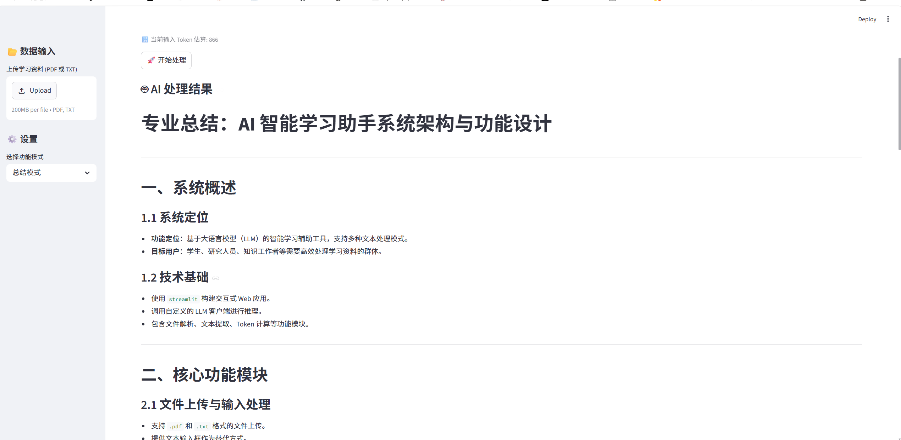
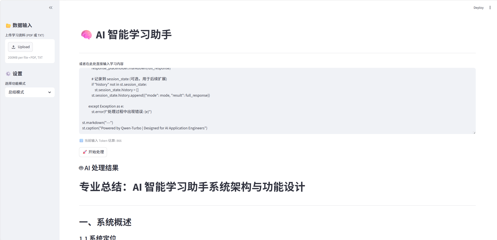

# 🧠 AI 智能学习助手 (Smart Study Assistant)

[](https://www.python.org/)
[](https://streamlit.io/)
[](https://openai.com/)

这是一个专为学习者设计的 AI 辅助工具，旨在通过大语言模型（LLM）技术，将繁杂的学习资料（文档、笔记、代码）快速转化为结构化、易吸收的知识。

---

## 🌟 核心功能

*   **多模式 Prompt 切换器**：支持总结、重点提取、思维导图式结构化、改写及针对性问答。
*   **多格式支持**：支持直接粘贴文本或上传 PDF/TXT 学习资料。
*   **流式输出 (Streaming)**：实时展示 AI 生成过程，提升交互体验。
*   **Token 成本监控**：基于 `tiktoken` 实时预估消耗，帮助开发者掌握 API 成本。
*   **结构化输出**：自动生成 Markdown 格式的知识框架，支持一键复制到笔记软件。

---

## 📸 页面展示

### 1. 整体界面展示


### 2. 代码知识总结


### 3. 专业代码块识别


---

## 🛠️ 技术架构

项目采用模块化设计，方便开发者学习与二次开发：

```text
smart-study-assistant/
├── llm/                # 大模型逻辑核心
│   ├── client.py       # API 客户端封装（支持流式、异常处理）
│   └── prompts.py      # 结构化提示词仓库（Prompt Engineering）
├── utils/              # 工具库
│   ├── file_loader.py  # 文件解析（PDF/TXT）
│   └── tokenizer.py    # Token 计算与成本控制
├── src/                # 静态资源（图片等）
├── app.py              # Streamlit 主程序（UI 交互逻辑）
├── config.py           # 配置文件（API Key, Base URL 等）
└── requirements.txt    # 项目依赖
```

---

## 🚀 快速开始

### 1. 克隆项目与安装依赖
```bash
pip install -r requirements.txt
```

### 2. 配置 API Key
在 `config.py` 中填入你的 API Key 和 Base URL：
```python
OPENAI_API_KEY = "你的KEY"
OPENAI_BASE_URL = "https://dashscope.aliyuncs.com/compatible-mode/v1" # 默认支持通义千问
```

### 3. 运行应用
```bash
streamlit run app.py
```

---

## 🎓 AI 应用工程师核心要点 (Core Insights)

本项目的价值不仅在于功能，更在于其展示了 AI 应用开发的标准范式：

1.  **Prompt Engineering (提示词工程)**：
    *   在 `prompts.py` 中使用了 **Few-shot (少样本提示)** 技巧，通过定义 Level 1/2/3 结构引导模型输出稳定的思维导图格式。
    *   实现了 **Role-based (基于角色)** 的指令设计，增强模型在特定任务下的专业性。

2.  **Token 管理与优化**：
    *   通过 `tiktoken` 库在请求前进行长度估算。对于 AI 应用工程师而言，这是防范“长文本攻击”和控制运营成本的必修课。

3.  **用户体验 (UX) 优化**：
    *   **流式渲染**：解决了大模型生成时间长导致的“界面假死”问题。
    *   **条件渲染**：根据选择的功能模式动态显示输入框，保持界面简洁。

4.  **工程化解耦**：
    *   将 Prompt 与业务逻辑分离。这种设计允许开发者在不修改代码逻辑的情况下，通过调整 `prompts.py` 快速迭代模型表现。

---

## 🤝 贡献与反馈

欢迎提交 Issue 或 Pull Request，共同完善这个智能学习助手！

---
*Designed for AI Application Engineers | Powered by Qwen-Turbo*
